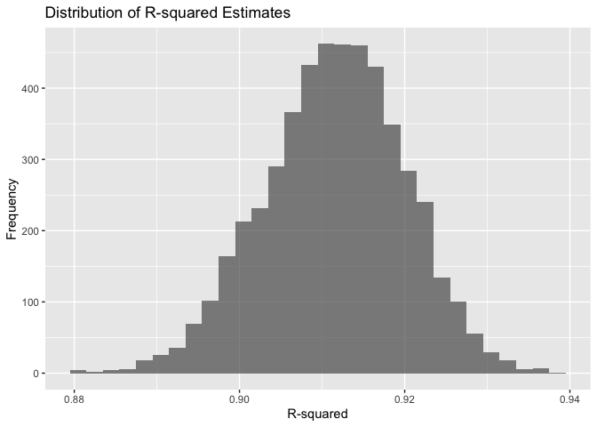
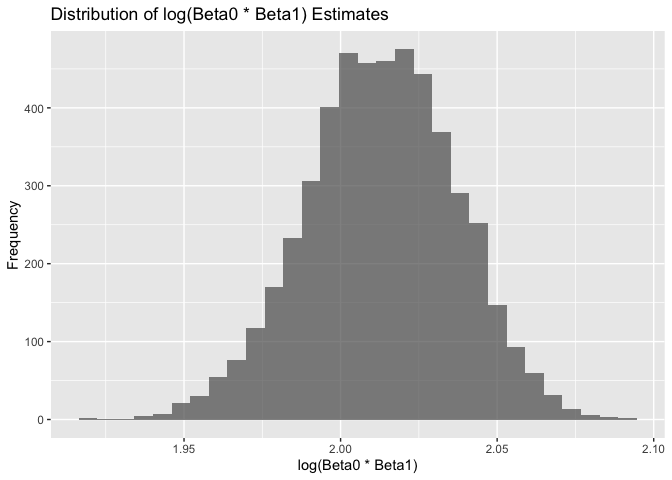

p8105_hw5_sw3455
================
Shiying Wu
2024-11-13

``` r
weather_df <- rnoaa::meteo_pull_monitors(
  c("USW00094728"),
  var = c("PRCP", "TMIN", "TMAX"), 
  date_min = "2017-01-01",
  date_max = "2017-12-31"
) |>
  mutate(
    name = recode(id, USW00094728 = "CentralPark_NY"),
    tmin = tmin / 10,
    tmax = tmax / 10
  ) |>
  select(name, id, everything())
```

    ## using cached file: /Users/angel/Library/Caches/org.R-project.R/R/rnoaa/noaa_ghcnd/USW00094728.dly

    ## date created (size, mb): 2024-09-26 10:26:11.827766 (8.651)

    ## file min/max dates: 1869-01-01 / 2024-09-30

``` r
bootstrap_analysis <- function(data, n_bootstrap = 5000) {
  results <- vector("list", n_bootstrap)
  
  for (i in 1:n_bootstrap) {
    sample_data <- data |> sample_frac(size = 1, replace = TRUE)
    model <- lm(tmax ~ tmin, data = sample_data)
    
    r_squared <- glance(model)$r.squared
    coefficients <- tidy(model)
    log_b0_b1 <- log(prod(coefficients$estimate))
    
    results[[i]] <- tibble(r_squared = r_squared, log_b0_b1 = log_b0_b1)
  }
  
  results_df <- bind_rows(results)
  return(results_df)
}

bootstrap_results <- bootstrap_analysis(weather_df)

str(bootstrap_results)
```

    ## tibble [5,000 × 2] (S3: tbl_df/tbl/data.frame)
    ##  $ r_squared: num [1:5000] 0.909 0.905 0.925 0.908 0.918 ...
    ##  $ log_b0_b1: num [1:5000] 2.06 2.02 1.99 2.04 2.07 ...

``` r
ggplot(bootstrap_results, aes(x = r_squared)) +
  geom_histogram(bins = 30, alpha = 0.7) +
  labs(title = "Distribution of R-squared Estimates", x = "R-squared", y = "Frequency")
```

<!-- -->

``` r
ggplot(bootstrap_results, aes(x = log_b0_b1)) +
  geom_histogram(bins = 30, alpha = 0.7) +
  labs(title = "Distribution of log(Beta0 * Beta1) Estimates", x = "log(Beta0 * Beta1)", y = "Frequency")
```

<!-- -->

``` r
quantile(bootstrap_results$r_squared, probs = c(0.025, 0.975))
```

    ##      2.5%     97.5% 
    ## 0.8945701 0.9271042

``` r
quantile(bootstrap_results$log_b0_b1, probs = c(0.025, 0.975))
```

    ##     2.5%    97.5% 
    ## 1.964166 2.058364

``` r
homicide <- read_csv("data/homicide-data.csv", na = c(".", "NA", "", "Unknown"))
```

    ## Rows: 52179 Columns: 12
    ## ── Column specification ────────────────────────────────────────────────────────
    ## Delimiter: ","
    ## chr (8): uid, victim_last, victim_first, victim_race, victim_sex, city, stat...
    ## dbl (4): reported_date, victim_age, lat, lon
    ## 
    ## ℹ Use `spec()` to retrieve the full column specification for this data.
    ## ℹ Specify the column types or set `show_col_types = FALSE` to quiet this message.

``` r
homicide <- homicide |>
  drop_na()|>
  mutate(city_state = paste(city, state, sep = ", "),
         solved = as.numeric(disposition == "Closed by arrest"),
         victim_age = as.numeric(victim_age)) |>
  filter(!city_state %in% c("Dallas, TX", "Phoenix, AZ", "Kansas City, MO", "Tulsa, AL"),
         victim_race %in% c("White", "Black")) |>
  mutate(victim_race = fct_relevel(victim_race, "White")) |>
  select(solved, city_state, victim_age, victim_race, victim_sex)

baltimore_model <- 
  glm(solved ~ victim_age + victim_sex + victim_race, data = filter(homicide, city_state == "Baltimore, MD"), family = binomial())

save(baltimore_model, file = "baltimore_model.RData")

baltimore_model |> 
  broom::tidy()|>
  filter(term == "victim_sexMale")|>
  mutate(
    or = exp(estimate),
    lower_ci = exp(estimate - 1.96 * std.error),
    upper_ci = exp(estimate + 1.96 * std.error)
  ) |> 
  select(term, or, lower_ci, upper_ci, p.value) |>
  knitr::kable(digits = 3)
```

| term           |    or | lower_ci | upper_ci | p.value |
|:---------------|------:|---------:|---------:|--------:|
| victim_sexMale | 0.426 |    0.325 |    0.558 |       0 |

The odds of solving a homicide in baltimore with a male victim are 0.426
times the odds of solving a homicide in baltimore with a female victim,
holding all other variables constant. This indicates that homicides with
female victims are more likely to be solved compared to those with male
victims, as the odds ratio is less than 1 and statistically significant
(p-value \< 0.05).

``` r
homicide_results <- homicide |>
  group_by(city_state) |>
  nest() |>
  mutate(
    model = map(data, ~ glm(solved ~ victim_sex + victim_age + victim_race, data = ., family = binomial())),
    tidied = map(model, tidy),
    glanced = map(model, glance)
  ) |>
  select(city_state, tidied, glanced) |>
  unnest(tidied) |>
  filter(term == "victim_sexMale") |>  
  mutate(
    or = exp(estimate),
    lower_ci = exp(estimate - 1.96 * std.error),
    upper_ci = exp(estimate + 1.96 * std.error)
  ) |>
  select(city_state, or, lower_ci, upper_ci, p.value) |>
  arrange(or)
homicide_results |>
  knitr::kable(digits = 3)
```

| city_state         |    or | lower_ci | upper_ci | p.value |
|:-------------------|------:|---------:|---------:|--------:|
| San Bernardino, CA | 0.352 |    0.099 |    1.249 |   0.106 |
| San Diego, CA      | 0.369 |    0.153 |    0.891 |   0.027 |
| Baton Rouge, LA    | 0.381 |    0.209 |    0.695 |   0.002 |
| Omaha, NE          | 0.382 |    0.203 |    0.721 |   0.003 |
| Cincinnati, OH     | 0.400 |    0.236 |    0.677 |   0.001 |
| Chicago, IL        | 0.410 |    0.336 |    0.501 |   0.000 |
| Long Beach, CA     | 0.410 |    0.156 |    1.082 |   0.072 |
| Baltimore, MD      | 0.426 |    0.325 |    0.558 |   0.000 |
| Pittsburgh, PA     | 0.431 |    0.265 |    0.700 |   0.001 |
| Denver, CO         | 0.479 |    0.236 |    0.971 |   0.041 |
| Philadelphia, PA   | 0.490 |    0.373 |    0.645 |   0.000 |
| Louisville, KY     | 0.491 |    0.305 |    0.790 |   0.003 |
| Buffalo, NY        | 0.515 |    0.287 |    0.925 |   0.026 |
| Miami, FL          | 0.515 |    0.304 |    0.872 |   0.013 |
| Columbus, OH       | 0.546 |    0.387 |    0.770 |   0.001 |
| Oakland, CA        | 0.563 |    0.365 |    0.868 |   0.009 |
| Detroit, MI        | 0.582 |    0.462 |    0.734 |   0.000 |
| San Francisco, CA  | 0.608 |    0.317 |    1.165 |   0.134 |
| New Orleans, LA    | 0.641 |    0.453 |    0.906 |   0.012 |
| Boston, MA         | 0.665 |    0.352 |    1.256 |   0.209 |
| Fort Worth, TX     | 0.666 |    0.395 |    1.121 |   0.126 |
| San Antonio, TX    | 0.672 |    0.369 |    1.222 |   0.193 |
| St. Louis, MO      | 0.690 |    0.519 |    0.915 |   0.010 |
| Washington, DC     | 0.691 |    0.469 |    1.018 |   0.062 |
| Houston, TX        | 0.705 |    0.553 |    0.899 |   0.005 |
| Memphis, TN        | 0.723 |    0.529 |    0.988 |   0.042 |
| Jacksonville, FL   | 0.726 |    0.541 |    0.975 |   0.033 |
| Milwaukee, wI      | 0.727 |    0.499 |    1.060 |   0.098 |
| Tampa, FL          | 0.808 |    0.348 |    1.876 |   0.619 |
| Charlotte, NC      | 0.845 |    0.530 |    1.347 |   0.479 |
| Las Vegas, NV      | 0.847 |    0.614 |    1.168 |   0.311 |
| Savannah, GA       | 0.867 |    0.422 |    1.780 |   0.697 |
| Birmingham, AL     | 0.873 |    0.576 |    1.322 |   0.521 |
| Indianapolis, IN   | 0.919 |    0.679 |    1.242 |   0.582 |
| Oklahoma City, OK  | 0.974 |    0.624 |    1.520 |   0.908 |
| Tulsa, OK          | 0.976 |    0.614 |    1.552 |   0.917 |
| Atlanta, GA        | 1.003 |    0.686 |    1.468 |   0.987 |
| Richmond, VA       | 1.006 |    0.498 |    2.033 |   0.987 |
| Durham, NC         | 1.006 |    0.456 |    2.219 |   0.988 |
| Nashville, TN      | 1.018 |    0.672 |    1.542 |   0.935 |
| Minneapolis, MN    | 1.134 |    0.525 |    2.451 |   0.749 |
| Albuquerque, NM    | 1.734 |    0.814 |    3.695 |   0.154 |
| Fresno, CA         | 1.743 |    0.574 |    5.292 |   0.327 |

``` r
ggplot(homicide_results, aes(x = reorder(city_state, or), y = or)) +
  geom_point() +
  geom_errorbar(aes(ymin = lower_ci, ymax = upper_ci), width = 0.2) +
  coord_flip() + 
  labs(x = "City", y = "Adjusted Odds Ratio (Male vs. Female)",
       title = "Adjusted Odds Ratio for Solving Homicides by City") +
  theme_minimal() +
  theme(axis.text.y = element_text(size = 11))
```

<!-- -->
The plot displays adjusted odds ratios for solving homicides comparing
male to female victims across various U.S. cities, revealing significant
variability. Most of cities ’s odds ratio is less than 1 indicate a
higher likelihood of solving cases with female victims like Oakland in
CA has lowest value, while those above 1 suggest a better resolution
rate for male victims like Fresno in CA has highest value. The
confidence intervals vary widely, may due to differences in many
different factors, as Fresno in CA has widest confidence interval.

``` r
birthweight<- read_csv("data/birthweight.csv", na = c(".", "NA", "", "Unknown")) |>
  janitor::clean_names()
```

    ## Rows: 4342 Columns: 20
    ## ── Column specification ────────────────────────────────────────────────────────
    ## Delimiter: ","
    ## dbl (20): babysex, bhead, blength, bwt, delwt, fincome, frace, gaweeks, malf...
    ## 
    ## ℹ Use `spec()` to retrieve the full column specification for this data.
    ## ℹ Specify the column types or set `show_col_types = FALSE` to quiet this message.

``` r
birthweight <- birthweight |>
  mutate(
    babysex = case_when(
      babysex == 1 ~ "Male",
      babysex == 2 ~ "Female"),
    frace = case_when(
      frace == 1 ~ "White",
      frace == 2 ~ "Black",
      frace == 3 ~ "Asian",
      frace == 4 ~ "Puerto Rican",
      frace == 8 ~ "Other",
      TRUE ~ NA),
    mrace = case_when(
      mrace == 1 ~ "White",
      mrace == 2 ~ "Black",
      mrace == 3 ~ "Asian",
      mrace == 4 ~ "Puerto Rican",
      mrace == 8 ~ "Other",
      TRUE ~ NA),
    malform = case_when(
      malform == 0 ~ "Absent",
      malform == 1 ~ "Present",
      TRUE ~ NA)) |>
  drop_na()
```

I assume that the women’s age, height, weight before pregnancy, and
income would as predictor.

``` r
birthmodel <- lm(bwt ~ ppwt + mheight + momage + fincome, data = birthweight)
birthweight |>
  modelr::add_predictions(birthmodel) |>
  modelr::add_residuals(birthmodel) |>
  ggplot(aes(x = pred, y = resid)) +
  geom_point(alpha = 0.5) +
  geom_smooth(col = "red") +
  labs(x = "Predicted Birthweight", y = "Residuals")
```

    ## `geom_smooth()` using method = 'gam' and formula = 'y ~ s(x, bs = "cs")'

<!-- -->
The residuals plot against predicted birthweight indicates a nonlinear
relationship and heteroscedasticity. In a perfectly linear relationship,
the residuals should appear as random scatter—without any systematic
pattern—around the horizontal line at zero, but in our plot, it does not
looks like spread randomly but cluster in middle, so we may need some
transformation based on it. The plot shows signs of heteroscedasticity
as indicated by the increasing spread of residuals as the predicted
birthweight values increase, forming a fan-like shape. This pattern
suggests that the variability of residuals is not constant and tends to
grow with larger values of predicted birthweight, violating the
assumption of homoscedasticity essential for linear regression.

``` r
ggplot(birthweight,aes(x = bwt)) + geom_histogram()
```

    ## `stat_bin()` using `bins = 30`. Pick better value with `binwidth`.

<!-- -->

``` r
ggplot(birthweight,aes(x = ppwt)) + geom_histogram()
```

    ## `stat_bin()` using `bins = 30`. Pick better value with `binwidth`.

<!-- -->

``` r
ggplot(birthweight,aes(x = mheight)) + geom_histogram()
```

    ## `stat_bin()` using `bins = 30`. Pick better value with `binwidth`.

<!-- -->

``` r
ggplot(birthweight,aes(x = momage)) + geom_histogram()
```

    ## `stat_bin()` using `bins = 30`. Pick better value with `binwidth`.

<!-- -->

``` r
ggplot(birthweight,aes(x = fincome)) + geom_histogram()
```

    ## `stat_bin()` using `bins = 30`. Pick better value with `binwidth`.

<!-- -->

``` r
birthmodel <- lm(bwt ~ log(ppwt+1) + mheight + log(momage+1) + log(fincome+1), data = birthweight)
birthweight |>
  modelr::add_predictions(birthmodel) |>
  modelr::add_residuals(birthmodel) |>
  ggplot(aes(x = pred, y = resid)) +
  geom_point(alpha = 0.5) +
  geom_smooth(col = "red") +
  labs(x = "Predicted Birthweight", y = "Residuals")
```

    ## `geom_smooth()` using method = 'gam' and formula = 'y ~ s(x, bs = "cs")'

<!-- -->
By checking each individual’s distribution, I noticed the right skewness
of ppwt, momage and fincome, so I use log transformation to make it more
normal. The residual plot is still really concentrate into middle with a
pattern but better than previous plot. The plot is not optimal and worth
more investigation and improvement in future.

``` r
cv_folds <- modelr::crossv_mc(birthweight, 100)

cv_df <- cv_folds |>
  mutate(train = map(train, as_tibble),
         test = map(test, as_tibble),
         birthmodel = map(train, \(df) lm(bwt ~ log(ppwt+1) + mheight + log(momage+1) + log(fincome+1), data = df)),
         model1 = map(train, \(df) lm(bwt ~ blength + gaweeks, data = df)),
         model2 = map(train, \(df) lm(bwt ~ bhead * blength * babysex, data = df)),
         rmse = map2_dbl(birthmodel, test, \(mod, df) rmse(model = mod, data = df)),
         rmse1 = map2_dbl(model1, test, \(mod, df) rmse(model = mod, data = df)),
         rmse2 = map2_dbl(model2, test, \(mod, df) rmse(model = mod, data = df)))

cv_df |>
  select(starts_with("rmse")) |>
  pivot_longer(
    everything(), 
    names_to = "model",
    values_to = "rmse") |>
  mutate(model = fct_inorder(model)) |> 
  ggplot(aes(x = model, y = rmse)) +
  geom_violin() +
  labs(x = "Model",y = "RMSE")
```

<!-- -->
The RMSE comparison plot visualizes the prediction errors across three
models, each distinct in their complexity and approach. The base model
(‘rmse’) presents the widest error distribution, suggesting it might be
too complex, possibly overfitting the data. In contrast, Model 1
(‘rmse1’), using just length and gestational age, exhibits a more
focused distribution with consistently lower errors, indicating a
balanced and effective approach to prediction. Model 2 (‘rmse2’), which
includes a comprehensive set of interactions, shows an error profile
slightly broader than Model 1 but less varied than the base model,
suggesting it captures complex relationships without excessive
overfitting. This visualization aids in selecting Model 1 as the optimal
choice for achieving reliable and accurate predictions, given its lower
and more stable RMSE values.
